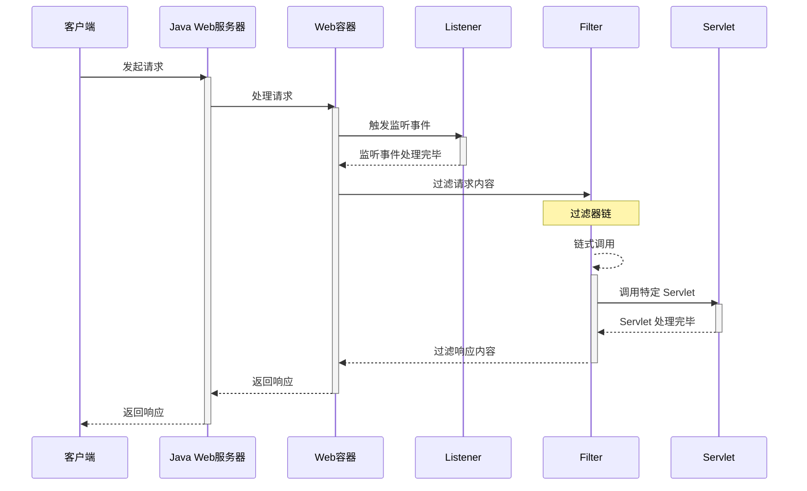

# 基本原理
> Java Web 服务器一般由 Web 容器和 Servlet/JSP 引擎两部分组成。其中，Web 容器负责处理 HTTP 请求和响应，而 Servlet/JSP 引擎则负责将Servlet 和 JSP 编译成可执行的 Java 代码.

## Web 容器
Web 容器有很多不同的实现,如:
- Tomcat
- Jboss
- WebLogic
- WebSphere
- Oracle9i AS
- Jetty 

## http 请求生命周期
一个请求的生命周期通常包括以下几个阶段：

1. 容器初始化阶段：在Web应用启动时，Web容器会初始化并加载应用程序的配置、Servlet、过滤器、监听器等组件。

2. 请求转发和过滤阶段：请求的转发以及过滤器的处理。

3. 请求处理阶段：Web 容器会根据请求的 URL 匹配相应的Servlet，并调用 Servlet 的相关方法进行请求处理。

4. 响应处理阶段：当 Servlet 完成请求处理后，会生成相应的响应数据并发送给客户端。

下面是一个请求的生命周期:

其中监听器较为特殊,可以在容器初始化、请求处理、请求转发、响应处理等不同的阶段触发。例如:
1. 在容器初始化阶段可以触发 ServletContextListener 的`contextInitialized()`方法，用于执行一些初始化操作。
2. 在请求处理阶段可以触发 ServletRequestListener 的`requestInitialized()`方法.
3. 在响应处理阶段可以触发 ServletRequestListener 的`requestDestroyed()`方法.

以实现 Webshell 的角度来看,Web 容器, Listener, Filter, Servlet 都可以接收我们的输入, 在其中任意一个环节中插入恶意代码都可以实现 Webshell.

## 动态注册
在编写 Java Web 应用时,如果要将一个类作为 Servlet、Filter 或 Listener 来使用,需要将其注册到 Web 容器中.

Web 容器通常会提供多种方式来注册 Servlet、Filter 和 Listener。常见的一些方式如下:
1. 配置文件（如web.xml）：使用传统的部署描述文件可以配置 Servlet、Filter 和 Listener 的映射关系。在 web.xml 中可以定义 servlet、filter 和 listener 并配置相应的类名、URL模式或Servlet名称等信息。

2. 注解：使用 Servlet 3.0 及以上版本提供的注解可以在代码中直接标注Servlet、Filter 和 Listener。通过在类上添加`@WebServlet`、`@WebFilter`或`@WebListener`注解，并配置相应的 URL 模式、Servlet 名称或监听事件等参数就可以进行注册。

3. 编程接口：通过编写 Java 代码，可以使用 Web 容器提供的编程接口来注册Servlet、Filter 和 Listener。不同的 Web 容器可能提供不同的 API.一般都会提供类似 addServlet()、addFilter() 和 addListener() 等方法.

三种方式中,前两种方式需要在修改源代码的情况下完成, 只有第三种方式可以满足 webshell 的场景. 当获取了 Java Web 代码执行的权限后, 就可以通过 addServlet 等函数动态地创建一个 webshell.

## 内存马实现步骤
1. 第一步：获取 context。所谓 context 值的是当前中间件或框架保存和控制 servlet、filter 等功能的对象。内存马使用到的 serlvet、filter、listener 等对象最终都需要注册到 context 中才能够生效。
2. 第二步：创建servlet、filter、controller 等恶意对象
3. 第三步：使用各类 context 对象的方法，向中间件或框架动态添加 servlet、filter 或controller 等恶意对象，完成内存马的注入。

# 各类 MemoryShell
- [Tomcat](../Java-Tomcat-内存马)

# 参考资料
- [Java Web服务器原理综述 - 掘金](https://juejin.cn/post/7224330515536183353)
- [Java安全学习——内存马 - 枫のBlog](https://goodapple.top/archives/1355)
- [JAVA内存马的“一生” - 先知社区](https://xz.aliyun.com/t/11003#toc-9)